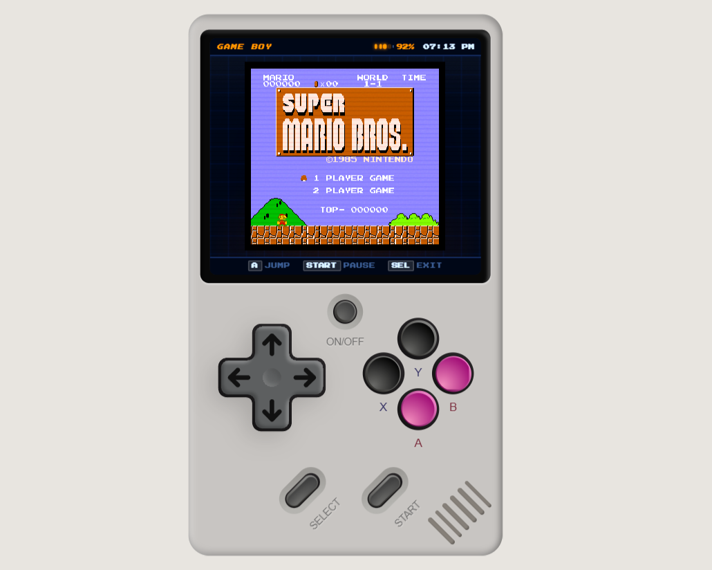

# 🎮 Web-Based GameBoy Emulator & Vintage OS



**Live Demo:** [game-boy-ashen.vercel.app](https://game-boy-ashen.vercel.app/)

A meticulously crafted, high-performance web-based GameBoy hardware simulator and "Vintage OS" launcher. Built with **React 18**, **Vite**, and **TypeScript**, this project delivers a premium retro gaming experience directly in your browser, with a primary focus on authentic **Super Mario Bros** gameplay.

---

## 🌟 The Mario Experience

The crown jewel of this project is the fully integrated **NES Emulation engine** (powered by `jsnes`), optimized for the browser to run **Super Mario Bros** at a silky-smooth 60 FPS.

- **High-Performance Rendering**: Uses a custom 32-bit pixel buffer for massive performance boosts on mobile devices.
- **Authentic Feel**: Pixel-perfect scaling, scanline overlays, and responsive input handling designed to mimic the original hardware.
- **Zero-Lag Emulation**: Intelligent frame-skipping and resource management ensure a consistent gameplay experience even on mid-range smartphones.

---

## ✨ Key Features

- 🕹️ **Pro-Grade NES Emulator**: A functional emulator running *Super Mario Bros* with dedicated pause/resume logic.
- 🍏 **Built-In Classic Games**: Includes fully playable, custom-built web versions of classic **Snake** and **Tetris**.
- 📟 **Vintage OS Launcher**: A custom retro-themed launcher interface for selecting games, tracking high scores (Stats), and managing device settings.
- 🎨 **Premium Aesthetics**: Carefully designed CSS shading, gradients, scanline animations, and responsive SVG hardware components.
- 🔊 **Chiptune Audio System**: Realistic system sound effects and game audio powered by `howler.js`.
- 📊 **Persistence & State**: Built with `zustand` and `localStorage` to persist high scores, total play counts, and system preferences across sessions.
- 📱 **Mobile-First Design**: Optimized for touch with a responsive D-Pad and Action buttons, featuring `dvh` units for perfect full-screen fit.

---

## ⚙️ Core Philosophy: THE ONE-BUTTON RULE

To maintain the purity of the retro experience, all navigation follows the **One-Button Rule**:
- The physical **MENU** button acts as the universal system toggle.
- Press **MENU** to power on, and press it again from any screen to access the power-off confirmation.
- Direct hardware interaction makes the "software" feel like a real device.

---

## 🛠️ Tech Stack

- **Framework:** [React 18](https://reactjs.org/)
- **Build System:** [Vite](https://vitejs.dev/)
- **Type Safety:** [TypeScript 5](https://www.typescriptlang.org/)
- **Styling:** [Tailwind CSS v4](https://tailwindcss.com/) + Custom CSS Glassmorphism
- **Emulation:** [JSNES](https://github.com/bfirsh/jsnes) (NES Core)
- **State Management:** [Zustand](https://github.com/pmndrs/zustand)
- **Audio Engine:** [Howler.js](https://howlerjs.com/)
- **Icons:** [Lucide React](https://lucide.dev/)

---

## 🚀 Getting Started

Experience the vintage vibe on your local machine:

### Prerequisites

- **Node.js** (v18.x or higher)
- **npm** or **pnpm**

### Installation

1. **Clone the repository:**
   ```bash
   git clone https://github.com/your-username/gameboy-emulator.git
   cd gameboy-emulator
   ```

2. **Install dependencies:**
   ```bash
   npm install
   ```

3. **Start the engine:**
   ```bash
   npm run dev
   ```

4. **Launch:**
   Open `http://localhost:5173` and hit the **MENU** button to boot!

---

## 🎮 Controls

### Desktop (Keyboard)
- **D-Pad:** Arrow Keys (`Up`, `Down`, `Left`, `Right`)
- **A Button:** `Z` (Jump / Confirm)
- **B Button:** `X` (Run / Back)
- **Start:** `Enter` (Pause / Launch)
- **Select:** `Shift` (Exit Game / Nav)
- **System Menu:** `Esc` (Power On/Off)

### Mobile (Touch)
A fully responsive touch-glass interface provides tactile feedback and visual highlights for all hardware buttons, support portrait and landscape orientations.

---

## 📁 Project Structure

```text
├── src/
│   ├── app/
│   │   ├── components/       # Reusable OS layout & UI atoms
│   │   ├── NESEmulator.tsx   # Mario/NES core & performance loop
│   │   ├── VintageOS.tsx     # Menu system & Launcher
│   │   ├── SnakeGame.tsx     # Custom React Snake implementation
│   │   ├── TetrisGame.tsx    # Custom React Tetris implementation
│   │   └── SettingsScreen.tsx# Device & Audio configuration
│   ├── stores/               # Zustand state & persistence logic
│   ├── hooks/                # Audio & Input lifecycle hooks
│   └── imports/              # Complex SVG hardware assets
```

---

## 📜 License & Disclaimers

Distributed under the MIT License. 
*Note: Any embedded game ROMs (e.g., Mario) are property of their respective copyright holders. This project is a technical demonstration of web-based emulation and hardware simulation for educational purposes.*

---
*Built with ❤️ for the love of 8-bit gaming.*

